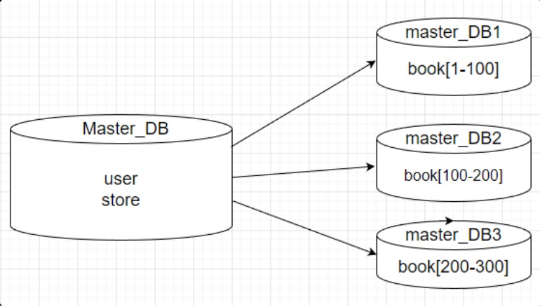

# Домашнее задание к занятию "`Репликация и масштабирование. Часть 2`" - `Chernov Vyacheslav`

## Задание 1
Опишите основные преимущества использования масштабирования методами:

активный master-сервер и пассивный репликационный slave-сервер;
master-сервер и несколько slave-серверов;
Дайте ответ в свободной форме.

## Задание 2
Разработайте план для выполнения горизонтального и вертикального шаринга базы данных. База данных состоит из трёх таблиц:

пользователи,
книги,
магазины (столбцы произвольно).
Опишите принципы построения системы и их разграничение или разбивку между базами данных.

Пришлите блоксхему, где и что будет располагаться. Опишите, в каких режимах будут работать сервера.

# Решение.

## Задание 1
Опишите основные преимущества использования масштабирования методами:
активный master-сервер и пассивный репликационный slave-сервер;
master-сервер и несколько slave-серверов;

Активный master + пассивный slave
Главное преимущество — простота и надёжность. Master принимает все изменения, а slave молча копирует их и стоит «про запас». Если master внезапно выйдет из строя, можно вручную (или с помощью скрипта) перевести slave в режим master и продолжить работу. Такая схема отлично подходит для резервного копирования и быстрого восстановления — при этом она легко настраивается и почти не ломается.

Master + несколько slaves
Здесь главное — масштабирование чтения и отказоустойчивость. Поскольку все slaves содержат полную копию данных, нагрузку от запросов на чтение (а их в большинстве систем 90–95%) можно распределить между ними. Это сильно разгружает master и повышает общую производительность. Плюс, если один slave упадёт — остальные продолжат работать, и система не пострадает. Такая архитектура часто используется на сайтах с высокой посещаемостью: всё пишется в один master, а читают — с любого из множества slaves.

## Задание 2

 Вертикальное масштабирование  
 Каждая таблица на отдельном сервере:  
 пользователи → DB-Users   
 книги → DB-Books   
 магазины → DB-Stores  
 Режим: master   

 

 Горизонтальное масштабирование  
 Таблицы делятся на части по ключу:  
 Книги:  
 Shard-1: book_id 1-100    
 Shard-2: book_id 100-200  
 Shard-3: book_id 200-300  
 Режим: master  
 
   

  Вертикальное масштабирование разделяет таблицы на отдельные серверы. Горизонтальное делит строки внутри таблицы на части по ключу.

